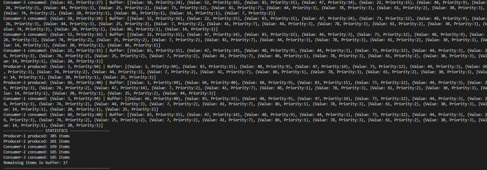
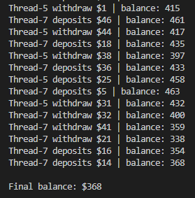
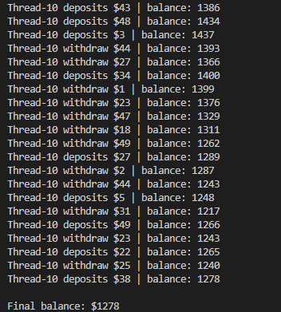

# Software Engineering Concept (SE LAB05)
## Topic: Concept of Multithreading

### Lab Overview
The purpose of this lab is to deepen your understanding of multithreading and concurrency in Java through
practical implementation of various concepts.

### Task 1: File Processing with Multithreading
#### Create a Java program that reads multiple text files concurrently using threads. Each thread should:
#### Read a different text file
- Count the number of words, lines, and characters in the file
- Print the results with thread name and processing time. E.g.,
- Use at least 3 different files and 3 threads
- Ensure to limit the number of concurrent threads to avoid overwhelming the system

#### Requirements:
- Implement using both Thread class extension and Runnable interface
- Handle file not found exceptions properly
- Measure and display execution time for each thread
- Create a folder named "bunchOfFiles" with sample text files for testing (at least 5 files with varying sizes) and put some other file types to test exception handling
- The summary of results should be displayed after all threads complete

#### Step execution and approach:
- Running your code inside Task1.java, FileThread, and FileRunnable
- Create three text files and process them concurrently using multithreading.
- Use two threading techniques:
- * One class extends Thread (FileThread)
- * One class implements Runnable (FileRunnable)
- Each thread reads one file only, so file processing is done in parallel.
- For each file, the thread:
- * Reads the file line by line
- * Counts words, lines, and characters
- Use AtomicInteger for total words, lines, and characters:
- * Ensures thread-safe updates
- * Prevents race conditions when multiple threads update shared totals
- Start all threads at the same time and wait for them using join().
- Measure total execution time from start to finish.
- Display:
- * Per-thread processing results
- * Overall totals after all threads complete
```
Scanning files in folder: bunchOfFiles...
--------------------------------- RESULTS -------------------------------------
Thread-2 processed file3.txt: 100 words, 1 lines, 745 characters in 9ms
Thread-1 processed file2.txt: 70 words, 1 lines, 519 characters in 9ms
Thread-0 processed file1.txt: 45 words, 1 lines, 296 characters in 10ms
-------------------------------------------------------------------------------
Total files processed: 3
Total word(s): 215
Total line(s): 3
Total character(s): 1560
Total processing time: 44 ms
```

### Task 2: Producer-Consumer with Priority Queue
##### Implement a Producer-Consumer pattern with the following specifications:
- Use a priority queue as the shared buffer (capacity: 10)
- Producer generates random numbers (1-100) with random priorities
- Consumer processes items based on priority (highest first)
- Create 2 producer threads and 3 consumer threads
- Run for 30 seconds and display statistics
#### Requirements:
- Implement proper synchronization
- Display buffer state after each operation
- Show total items produced and consumed by each thread
#### Step execution and approach:
- This task run in Task2.java
- Use a shared PriorityBlockingQueue (capacity 10) as the buffer so producers and consumers can safely access it without manual synchronized blocks, and items are always ordered by priority (highest first).
- Producers continuously generate random items (value + priority) and insert them into the queue; if the queue is full, they automatically block until space is available.
- Consumers continuously take items from the queue; if the queue is empty, they automatically block until an item is produced.
- The Item class implements Comparable so the priority queue always delivers the highest-priority item first, not FIFO order.
- The program runs all producer and consumer threads for 30 seconds, then interrupts them, waits for completion, and prints how many items each thread produced or consumed.<br>
### Output: 



### Task 3: Thread Pool Web Crawler Simulation
#### Create a web crawler simulation using thread pools:
- Simulate downloading web pages (use Thread.sleep() for delay)
- Each "page" has a random download time (1-5 seconds)
- Use different thread pool types: FixedThreadPool, CachedThreadPool, SingleThreadExecutor
- Process 20 URLs and compare performance
#### Requirements:
- Measure total execution time for each thread pool type
- Handle timeouts (max 10 seconds per page)
- Display which thread processed each URL
#### Step execution and approach:
- This task run in Task3.java
- Simulate a web crawler by treating each URL as a task (DownloadPage) that pretends to download a page using Thread.sleep() with a random delay.
- Use Callable<String> instead of Runnable so each task can return a result indicating which thread processed which URL and how long it took.
- Submit all URL tasks to an ExecutorService (thread pool), which manages thread creation, reuse, and task scheduling automatically.
- Store returned Future objects to:
- * Wait for task completion
- * Retrieve results
- * Enforce a maximum timeout of 10 seconds per page
- Run the same set of 20 URLs using three different thread pool types (Fixed, Cached, Single) to compare parallelism and total execution time.
- Measure performance by recording start and end time for each pool and printing which thread processed each URL.
```
Output:
Running with FixedThreadPool
pool-1-thread-1 processed page1 in 2 ms
pool-1-thread-2 processed page2 in 4 ms
pool-1-thread-3 processed page3 in 1 ms
pool-1-thread-4 processed page4 in 5 ms
pool-1-thread-5 processed page5 in 2 ms
pool-1-thread-3 processed page6 in 4 ms
pool-1-thread-5 processed page7 in 1 ms
pool-1-thread-1 processed page8 in 4 ms
pool-1-thread-5 processed page9 in 4 ms
pool-1-thread-2 processed page10 in 4 ms
pool-1-thread-4 processed page11 in 1 ms
pool-1-thread-3 processed page12 in 5 ms
pool-1-thread-4 processed page13 in 5 ms
pool-1-thread-1 processed page14 in 2 ms
pool-1-thread-5 processed page15 in 3 ms
pool-1-thread-2 processed page16 in 5 ms
pool-1-thread-1 processed page17 in 3 ms
pool-1-thread-5 processed page18 in 5 ms
pool-1-thread-3 processed page19 in 3 ms
pool-1-thread-4 processed page20 in 3 ms
Total execution time: 15048 ms
Running with CachedThreadPool
pool-2-thread-1 processed page1 in 3 ms
pool-2-thread-2 processed page2 in 5 ms
pool-2-thread-3 processed page3 in 5 ms
pool-2-thread-4 processed page4 in 2 ms
pool-2-thread-5 processed page5 in 1 ms
pool-2-thread-6 processed page6 in 1 ms
pool-2-thread-7 processed page7 in 3 ms
pool-2-thread-8 processed page8 in 5 ms
pool-2-thread-9 processed page9 in 2 ms
pool-2-thread-10 processed page10 in 4 ms
pool-2-thread-11 processed page11 in 4 ms
pool-2-thread-12 processed page12 in 3 ms
pool-2-thread-13 processed page13 in 4 ms
pool-2-thread-14 processed page14 in 4 ms
pool-2-thread-15 processed page15 in 1 ms
pool-2-thread-16 processed page16 in 4 ms
pool-2-thread-17 processed page17 in 5 ms
pool-2-thread-18 processed page18 in 1 ms
pool-2-thread-19 processed page19 in 5 ms
pool-2-thread-20 processed page20 in 5 ms
Total execution time: 5013 ms
Running with SingleThreadExecutor
pool-3-thread-1 processed page1 in 2 ms
pool-3-thread-1 processed page2 in 1 ms
pool-3-thread-1 processed page3 in 4 ms
pool-3-thread-1 processed page4 in 2 ms
pool-3-thread-1 processed page5 in 2 ms
pool-3-thread-1 processed page6 in 5 ms
pool-3-thread-1 processed page7 in 4 ms
pool-3-thread-1 processed page8 in 1 ms
pool-3-thread-1 processed page9 in 3 ms
pool-3-thread-1 processed page10 in 1 ms
pool-3-thread-1 processed page11 in 5 ms
pool-3-thread-1 processed page12 in 3 ms
pool-3-thread-1 processed page13 in 3 ms
pool-3-thread-1 processed page14 in 2 ms
pool-3-thread-1 processed page15 in 3 ms
pool-3-thread-1 processed page16 in 4 ms
pool-3-thread-1 processed page17 in 2 ms
pool-3-thread-1 processed page18 in 1 ms
pool-3-thread-1 processed page19 in 1 ms
pool-3-thread-1 processed page20 in 5 ms
Total execution time: 54165 ms
```

### Task 4: Bank Account Race Condition Demonstration
#### Create a program that demonstrates race conditions and their solutions:
- Implement a BankAccount class with deposit/withdraw methods
- Create both synchronized and non-synchronized versions
- Run 10 threads performing 100 random transactions each
- Compare final balances between synchronized and non-synchronized versions
#### Requirements:
- Start with initial balance of $1000
- Each transaction should be $1-50 (random)
- Display transaction history and final balance
- Explain the difference in results
#### Step execution and approach:
- Running your code in Task4.java which contain the logic in BankAccount.java
- Create a shared BankAccount object with initial balance $1000.
- Define deposit and withdraw methods in both synchronized and non-synchronized versions.
- Create 10 threads, each performing 100 random transactions (deposit or withdraw, $1–$50).
- Use a shared StringBuffer to record transaction history.
- Start all threads and wait for them to finish using join().
- Compare results: non-synchronized version may show incorrect final balance due to race conditions, synchronized version ensures correct and consistent balance.\
- Display transaction history and final balance for both versions.
#### Output:

